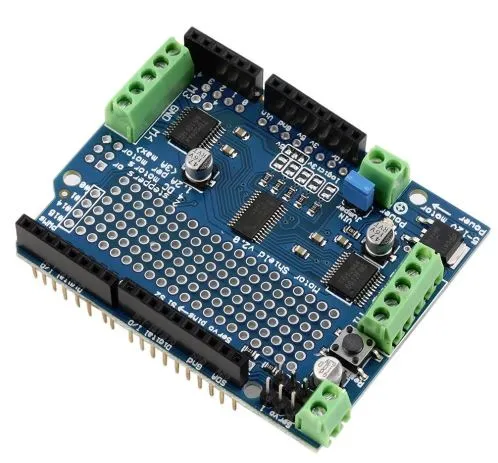

# Arduino Code for a 4 Vex Motor Robot

This is for a Robot(technically a rc car) that I am building in robotics, now this is where I'm just hosting the code.

Made by Michael Crawford

Does require an app to control, but probably with some tweaking you can getting working on anything else.

Recommend using PlatformIO to build this project, just to deal with the libraries much more easier.

## Special Thanks

Chaosbuster for the original code.
Adafruit for creating its various libraries that I used for this.
The entirety of Arduino.

### File Structure

├── include
│   └── README --> Nothing Yet
├── lib
│   └── README -->
├── platformio.ini --> Where all of our libraries get called from and also how this thing builds properly.
├── README.md  --> YOU ARE HERE.
├── src
│   ├── Char.h  --> Where our custom characters are defined.    NOTE: DOESN'T WORK PROPERLY AT THE MOMENT.
│   └── main.cpp    --> The main file and where the entirety of this program resides.
└── test
└── README

### Parts

- Arduino Mega 2560

- Adafruit MotorShield V2

    

    Note that it doesnt have to be the exact model, but I would recommend it for compatibilty purposes.

- SSD1306 128x64 OLED I2C display

- HC-05 Bluetooth Module

#### How it functions

We have 4 VEX 2-Wire 393 Motors connected to the Arduino.
^ Note: if you are doing this yourself, make sure you are checking where your motors are plugged into.

Then we define the motors by these four lines:

```cpp
Adafruit_MotorShield AFMS = Adafruit_MotorShield(); // Name of class that will allow us to define the motors.

Adafruit_DCMotor *BackR = AFMS.getMotor(4); // These names are based off from when you are looking at it from the behind.
Adafruit_DCMotor *BackL = AFMS.getMotor(3);
Adafruit_DCMotor *FrontR = AFMS.getMotor(2);
Adafruit_DCMotor *FrontL = AFMS.getMotor(1);
```

Which basically gets our motor depending on where they are plugged in. On the motorshield that we have, we have only 4 motor ports.

Then we take the motors that we have, and allow them to run. Now how do we do that? By creating a custom function that allows to set each motor and give it special parameters,

```cpp
void MSet(int speed, char motorType, bool isForward = true, bool isRelease = false)
{

  switch (motorType) // check to see if the char motorType is...
  {
  case 'A': // if its A(BackRight), then do the BackRight Motors.
    BackR->setSpeed(speed);
    if (isForward == false)
    {
            if (isRelease == true)
      {
        BackR->run(RELEASE);
      }
      BackR->run(BACKWARD);
    }
    else
    {
      BackR->run(FORWARD);
    }
    break;

  case 'B': // same thing but for the BackLeft motor and so on.
    BackL->setSpeed(speed);
    if (isForward == false)
    {
            if (isRelease == true)
      {
        BackL->run(RELEASE);
      }
      BackL->run(BACKWARD);

    }
    else
    {
      BackL->run(FORWARD);
    }
    break;

  case 'C':
    FrontL->setSpeed(speed);
    if (isForward == false)
    {
            if (isRelease == true)
      {
        FrontL->run(RELEASE);
      }
      FrontL->run(BACKWARD);

    }
    else
    {
      FrontL->run(FORWARD);
    }
    break;

  case 'D':
    FrontR->setSpeed(speed);
    if (isForward == false)
    {
            if (isRelease == true)
      {
        FrontR->run(RELEASE);
      }
      FrontR->run(BACKWARD);

    }
    else
    {
      FrontR->run(FORWARD);
    }
    break;
  }
}
```

In order to control 4 separate motors, I had to make it a switch case in order to control 4 different motors. Now the way that I did this may not be a good way of doing it, since its a switch case with a if statements happening right after. Its basically a big if statement that goes on for about 10+ lines, but I will find out later.

Now the way it works is that, first we check on what kind of character we pass in, if its A, do BackRight motors and so on and so on. Now along with that, we have 2 boolean parameters that we have *isForward* and *isRelease*.

Now these are both set to true and false respectively. We check to see if either one gets changed. If *isForward* gets set to false then go backwards, but we also need to check if the variable *isRelease* is also set true, if it is than just release the motors. Or in other words stop the motor(s).

Next we have to deal with the Display, now at my robotics class/club, we have a 128x64 oled display. Which is something I don't have at my house, I do own a 16x2 display that I use a lot for my Raspberry PI.
That's the reason why there is 2 different "UpdateDisplay" functions, *UpdateDisplay()* and *UpdateDisplay_I2C()*.

The *UpdateDisplay_I2C()* has a tiny bit more of complicated things in it, but that is due to the small 16x2 screen.

But to sum up on what those 2 functions do, we gather the Battery Voltage on pin A10 and display that to the screen.
Next we set the cursor to print the data that it is getting from the bluetooth app that we use.

Print the offset that we have in order for it to turn. and how fast it is going(not in any units, just basically how fast we set the motors).

Going over to where the ```cpp 
void loop()``` is at, we have to check to see if there is a spot for the bluetooth to communicate over serial. Then we check to see what kind of data is it getting send, depending on the character or integer and change the speed, what way its moving, or stop all motors entirety.
